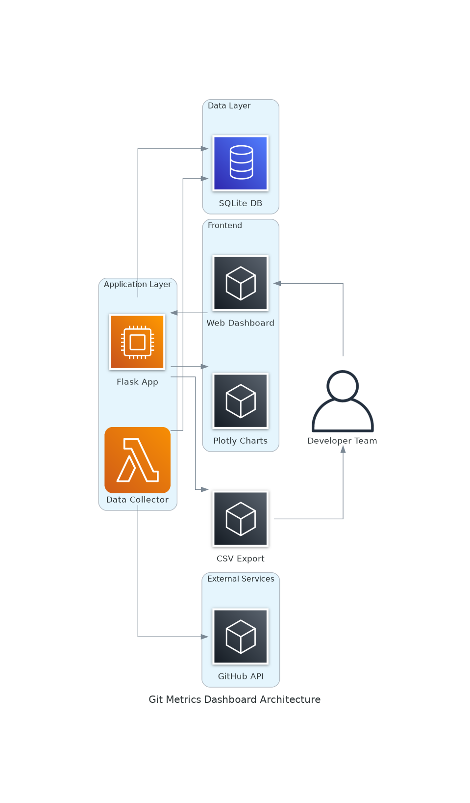

# Git Metrics Dashboard

Dashboard web para acompanhar métricas de performance do time através de commits Git.

## Arquitetura do Sistema



### Componentes:
- **Frontend**: Interface web com dashboard interativo usando Plotly.js
- **Backend**: Aplicação Flask para APIs e processamento
- **Data Collector**: Script Python para coleta de dados via GitHub API
- **Database**: SQLite para armazenamento local dos dados
- **Export**: Funcionalidade de exportação CSV

## Setup

1. **Instalar dependências:**
```bash
pip install -r requirements.txt
```

2. **Configurar GitHub Token:**
   - Gere um token no GitHub: Settings > Developer settings > Personal access tokens
   - Edite `config.json` e adicione seu token e repositórios

3. **Coletar dados iniciais:**
```bash
python data_collector.py
```

4. **Executar aplicação:**
```bash
python app.py
```

5. **Acessar:** http://localhost:5000

## Teste Rápido (Dados Mockados)

Para testar sem configurar GitHub:
```bash
python app_mock.py
```

## Configuração Automática (Cron)

Para coleta automática diária:
```bash
# Adicionar ao crontab
0 6 * * * cd /path/to/project && python data_collector.py
```

## Métricas Disponíveis

- **Commits por desenvolvedor** (por período/repo)
- **Pull Requests** (quantidade e tempo de merge)
- **Releases** (quantidade por repo)
- **Exportação CSV** de todos os dados

## Estimativa de Custos

### Cenário 1: Execução Local (Custo Zero)
- **Infraestrutura**: Máquina local/servidor existente
- **Banco de dados**: SQLite (arquivo local)
- **Custo mensal**: **$0.00**

### Cenário 2: Deploy na AWS (Custo Mínimo)
Para hospedar na AWS com alta disponibilidade:

| Serviço | Especificação | Custo Mensal |
|---------|---------------|--------------|
| **EC2 t3.micro** | 1 vCPU, 1GB RAM, Linux | $7.49 |
| **EBS gp3** | 8GB armazenamento | $0.64 |
| **Route 53** | Hosted Zone | $0.50 |
| **Data Transfer** | ~1GB/mês | $0.09 |
| **GitHub API** | Gratuito (5000 req/hora) | $0.00 |
| **Total** | | **$8.72/mês** |

### Cenário 3: Plataformas Gratuitas
- **Railway/Render/Vercel**: Tier gratuito
- **Limitações**: 500h/mês, sleep após inatividade
- **Custo mensal**: **$0.00**

### Recomendação
Para uso interno de time (6 devs):
- **Desenvolvimento/Teste**: Execução local ou plataforma gratuita
- **Produção**: AWS t3.micro ($8.72/mês) para garantir disponibilidade 24/7

## Estrutura

- `data_collector.py` - Coleta dados do GitHub
- `app.py` - Aplicação Flask principal
- `app_mock.py` - Versão com dados mockados
- `config.json` - Configuração de repos e token
- `templates/` - Interface web
- `metrics.db` - Banco SQLite (criado automaticamente)
- `generated-diagrams/` - Diagramas de arquitetura
